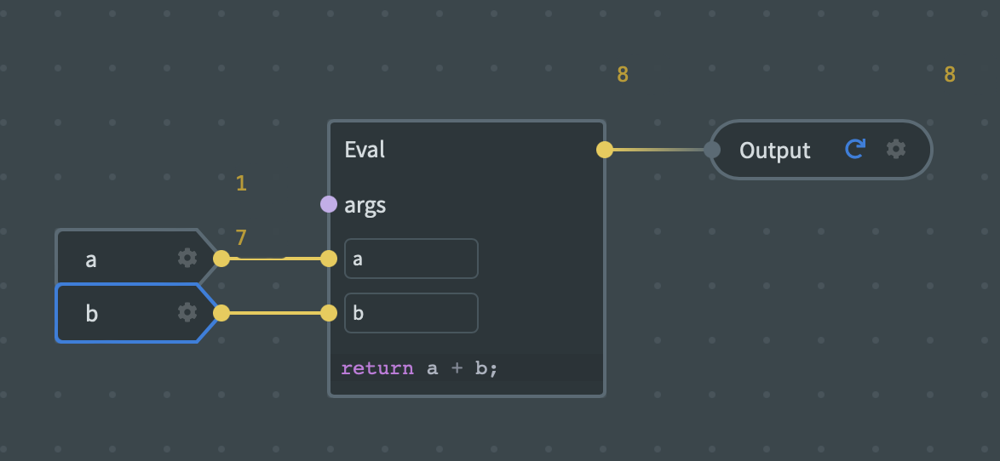

# Nodes

Nodes are the basic building blocks of a graph. A node on it's own is comparable to a function and can be connected together using their _sockets_ to put together more complex logic.

Each node performs some logic to produce an output. Most nodes also have inputs that determine the output (similar to _variables_). Consider a `Sum` node that adds two numbers together (two inputs, `1` + `7`), this would produce an output of `8`. These are represented by sockets on the Node iteself, with inputs on the left and the output on the right.

The inputs can be identified by the shape (the triangle towards the right), and an output can be identifed by the rounded corners. In this example, our node is `Eval` which allows us to write some JavaScript which process our inputs.

## Types of Nodes

There are two types of Nodes that you should understand the difference of:

 - **Standard Library** - these nodes cannot have their behaviour changed, they are provided by NodeScript. They give us the foundation to build more complex graphs.
 - **Modules** - these are covered in more detail [here](./modules), but succinctly they are ways of calling other graphs that perform their own logic.

## Adding Nodes to a Graph

When you are editing a graph, press your spacebar to view all the nodes that you can add to the canvas. You can search or scroll within the menu to find the node you would like to add.
