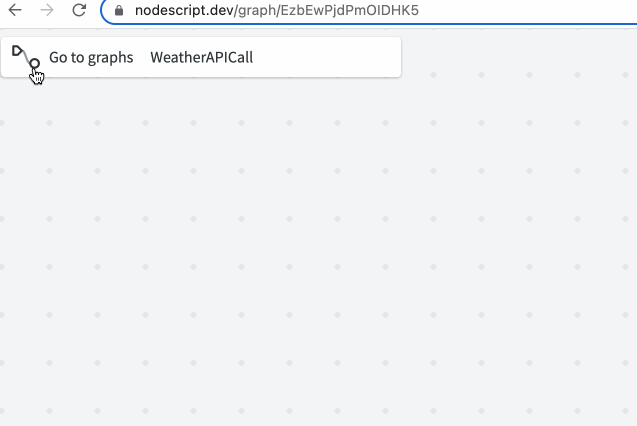
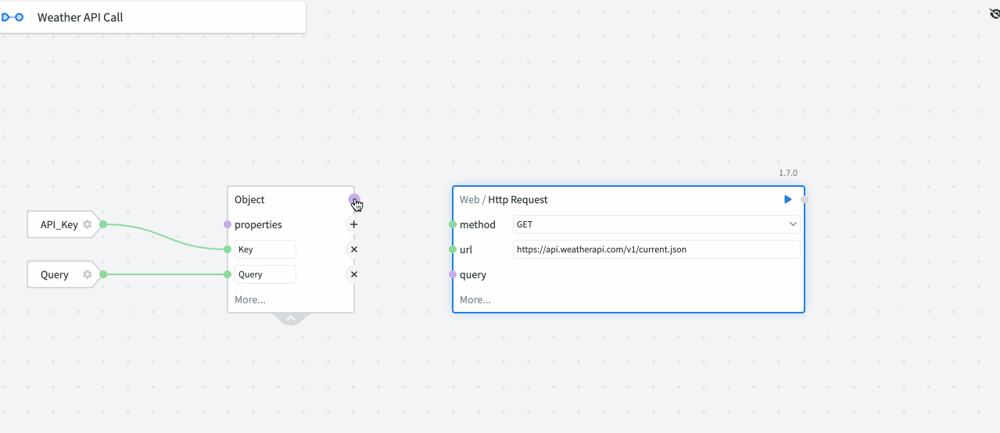

# First graph

## Weather Bot

In this tutorial we will make a simple NodeScript graph that tells us the weather with a GET request. This introductory workflow is designed to show you the basic functionality of the UI and how nodes connect.

Please visit https://nodescript.dev/ and sign in with GitHub to begin.

### Sign up for an API key:  
Before you can make the weather bot, you'll need to sign up for an API key. There are several weather APIs available, such as WeatherAPI and Weatherbit.

You can sign up for a free API key by visiting their websites and following the instructions. For this tutorial, we'll be using WeatherAPI.com. You can sign up for an API key at 
[weatherapi.com](https://www.weatherapi.com/signup.aspx)

### Create a new workspace:
- From the NodeScript dashboard select your user name from the SidePanel on the left of the screen.
- Select “Create Workspace” from the menu.
- Call the Workspace “WeatherBot”

### Create a new Graph:
- Select “New Graph” from the top of your Workspace, Graphs page.
- Rename the new graph by selecting the “New Graph” title in the top left of the canvas
- Rename your graph “WeatherAPICall”
	
### Create your API key Variable:
- Navigate the variables page by selecting the Icon next to the graph title and selecting “Variables” from the dashboard. 

- Select “Add variable” from the right side of the page.
- Title the variable “API_KEY” and add your Weatherapi key to the Value textbox.

### Set up the inputs for the GET request:
- Navigate back to your graph, right click on the canva, select “Variable” from the menu and add your newly created API_KEY variable.
- Also add an “New input” node to your graph and label it “Query”. Select the cog symbol on the new input, set the type to STRING and add a location to the default input, for our tutorial we will use “London”.

- Next, add an “Object” node to the graph by right clicking and searching.
- Give the object 2 properties by selecting the plus symbol on the node, call them Key and Query.

- Connect the nodes to the corresponding links by clicking and dragging the green circle.

### Make the GET request:

- Add a “Web/HTTP Request” node to your graph.
- Select “GET” from the “Method” drop menu.
- Add “https://api.weatherapi.com/v1/current.json” to the URL text box.
- Select “more” from the bottom of the node and select the “Query” option.
- Now, connect your previously created object to the Query input and press play!

Now we have successfully made an API call and we can see the results in JSON format above the Request node. However, we don't want all of this data, we want to filter it to just the important parts to our user. 

Thankfully NodeScript has a handy feature to help you do that quick and painlessly…

### Filter the data:

- Expand the JSONresponse, which will now be hovering about the Request node, (see gif below) by selecting the down arrow and click and drag the “Name” value from the Body to the Canvas:

- Do the same for the “localtime” and “object” values.

### Create the output

Finally, lets collect all the value together and create an output
- Add an object node with the properties for each value taken from the JSON and connect them accordingly.
- Create an “Output” node and connect your object to it. Hit play and you will have the location, time and temperature of the default value entered to your Query node.

Now, play around changing the default value in your query to see other locations!
